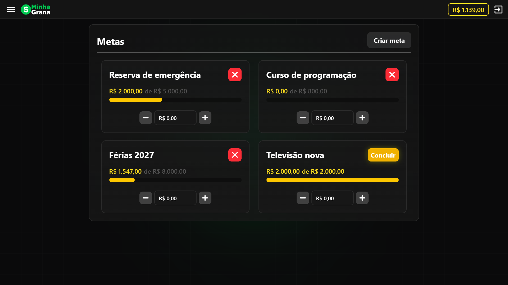

# Minha Grana

O Minha Grana é uma aplicação full-stack desenvolvida com foco em organização financeira e experiência de uso. A aplicação permite acompanhar o saldo, visualizar gastos por categoria, registrar transações e estabelecer metas financeiras com acompanhamento de progresso.

## Screenshots

### Dashboard

O dashboard apresenta uma visão geral das finanças do usuário, incluindo receitas, despesas, saldo, distribuição dos gastos por categoria e histórico das transações.


### Transações

A página de transações utiliza um calendário para facilitar a visualização das movimentações financeiras por dia. Também é possível criar e excluir transações diretamente pela interface.


### Metas

O sistema de metas permite definir objetivos financeiros, acompanhar o valor acumulado e visualizar o progresso de cada objetivo.



## Funcionalidades

### Dashboard financeiro

- Visualização do saldo geral.
- Total de receitas e despesas.
- Visão geral das despesas por categoria.
- Histórico das transações do mês.
- Navegação entre diferentes meses e anos.

### Transações

- Criação de transações de entrada e saída.
- Transações recorrentes e parceladas.
- Definição de categoria.
- Definição da data.
- Exclusão de transações.
- Visualização das transações através de um calendário.

### Transações recorrentes

O sistema possui suporte para transações recorrentes.

Uma transação recorrente pode continuar sendo considerada nos meses seguintes de acordo com sua data original, permitindo representar despesas e receitas como:

- Salário.
- Aluguel.
- Assinaturas.
- Mensalidades.
- Outras despesas ou receitas periódicas.

### Transações parceladas

O sistema também possui suporte para transações parceladas, permitindo dividir uma compra em múltiplas parcelas e registrar seus respectivos valores.

### Metas financeiras

- Criação de metas personalizadas.
- Definição de valor-alvo.
- Acompanhamento do valor atual.
- Barra de progresso.
- Adição e remoção de valores.
- Conclusão de metas.
- Exclusão de metas.

### Autenticação

- Registro de usuários.
- Login.
- Logout.
- Autenticação utilizando JWT.
- Token armazenado em cookie `HttpOnly`.
- Proteção das rotas autenticadas.
- Expiração do token.
- Controle de acesso baseado no usuário autenticado.

## Tecnologias utilizadas

### Frontend

- **React**
- **TypeScript**
- **Tailwind CSS**
- **Axios**
- **React Icons**
- **date-fns**
- **Vite**

### Backend

- **Node.js**
- **Express**
- **JavaScript**
- **MySQL**
- **mysql2**
- **JWT**
- **bcrypt**

### Segurança

- **Helmet**
- **express-rate-limit**
- **CORS**
- Cookies `HttpOnly`
- Variáveis de ambiente
- Validação de autenticação no backend

### Deploy

- **Vercel** — Frontend
- **Railway** — Backend e banco de dados MySQL

## Estrutura do projeto

```
Minha-Grana/
│
├── client/
│ ├── src/
│ │ ├── components/
│ │ ├── constants/
│ │ ├── contexts/
│ │ ├── pages/
│ │ ├── services/
│ │ ├── types/
│ │ └── utils/
│ │
│ └── ...
│
├── server/
│ ├── src/
│ │ ├── constants/
│ │ ├── controllers/
│ │ ├── middleware/
│ │ ├── routes/
│ │ └── services/
│ │
│ ├── server.js
│ └── ...
│
└── README.md
```

## Segurança

O backend possui algumas medidas para proteger a aplicação:

- Autenticação através de JWT.
- Tokens armazenados em cookies `HttpOnly`.
- Cookies configurados para ambiente de produção.
- `Helmet` para aplicação de headers de segurança.
- Rate limiting para reduzir tentativas excessivas de requisições.
- CORS configurado para permitir apenas a origem do frontend.
- Senhas armazenadas utilizando `bcrypt`.
- Informações sensíveis mantidas através de variáveis de ambiente.
- Validação de autenticação nas rotas protegidas.

## Objetivos do projeto

O Minha Grana foi desenvolvido com o objetivo de aplicar conhecimentos de desenvolvimento **frontend e backend** em uma aplicação real, trabalhando conceitos como:

- Desenvolvimento de APIs REST.
- Autenticação e autorização.
- Integração entre React e Express.
- Persistência de dados com MySQL.
- Modelagem de banco de dados.
- Organização de código em camadas.
- Tratamento de erros.
- Segurança de aplicações web.
- Gerenciamento de estado no frontend.
- Deploy de aplicações full-stack.
- Tratamento de datas e regras de negócio financeiras.

## Licença

Este projeto foi desenvolvido como um projeto pessoal para portfólio.
```
